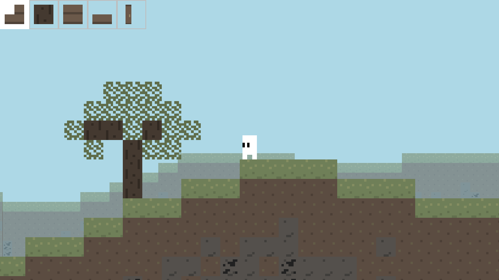
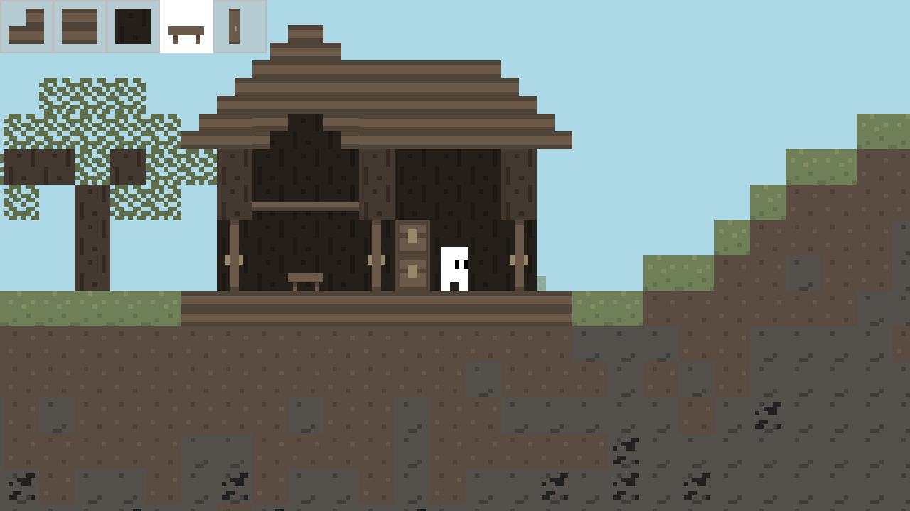
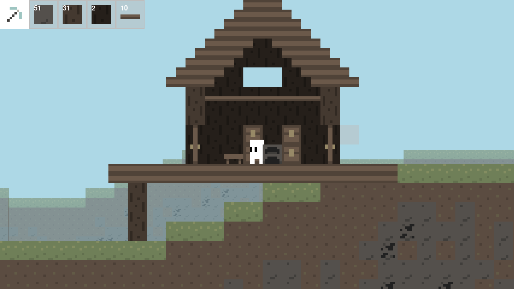

# Sphere's Sandbox Game
*A 2D Minecraft/Terraria-style sandbox block game*
___

This was a passion project I made in summer of 2023 to practice some game development skills with Python. I learned a lot about how to manage systems, load and save data, and work with graphics in general.
___
### Status:
The codebase has been adandoned for 7+ months. I will be coming back to make a new, improved version that will fix issues this had.
___
### Features
- Block breaking and placing
- Crafting
- Intentory management
- Functional chests
- Saving and loading worlds
- Menus
- "Physics"
- Block drops
- Infinite world
- Built-in screenshot system
___
### Screenshots
*All builds in screenshots built **in-game***

___
### Dependencies
- PyGame
- OpenSimplex